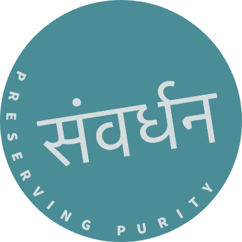

# Samvardhan - Preserving Purity 🌿
The website is live at : [Samvardhan Website](https://www.samvardhanfoundation.com)

> A full-stack web platform dedicated to environmental conservation and community welfare.

## 📖 About The Project

This project was developed by **Ajinkya Moharir**, **Tejas Retharekar**, and **Neel Naik** during our internship for our client, **Samvardhan**. 

The goal was to build a dynamic, user-friendly digital presence for the Samvardhan organization, enabling them to showcase their environmental initiatives, manage donations, and engage with the community. The platform features a responsive public interface and a robust admin dashboard for content management.

---

## ✨ Key Features

### 🌍 User Interface (Public)
* **Dynamic Timeline:** An interactive "Our Work" page tracking the organization's journey and events using scroll-triggered animations.
* **Photo Gallery:** A 3D tilt-effect gallery showcasing memories from various drives and events.
* **Donation Portal:** A secure workflow for donors to contribute via UPI, upload payment screenshots, and receive verification status.
* **Blogs & Updates:** A section for sharing articles, reports, and environmental insights.
* **Responsive Design:** Fully optimized for mobile and desktop devices using **Tailwind CSS**.
* **Modern Animations:** Smooth transitions and interactive elements powered by **Framer Motion**.

### 🛡️ Admin Dashboard (Private)
* **Secure Authentication:** JWT-based login system for administrators.
* **Donation Verification:** Review donor details and payment screenshots; verify donations with a single click.
* **Content Management:**
    * **Events:** Add, edit, or delete events from the timeline.
    * **Gallery:** Upload new photos with captions directly to Cloudinary.
    * **Blogs:** Publish and manage blog posts and external articles.
* **Live Statistics:** Real-time overview of total donations, pending verifications, and event counts.

---

## 🛠️ Tech Stack

### Frontend (Client)
* **Framework:** [React.js](https://react.dev/) + [Vite](https://vitejs.dev/)
* **Styling:** [Tailwind CSS](https://tailwindcss.com/)
* **Animations:** [Framer Motion](https://www.framer.com/motion/)
* **Routing:** React Router DOM
* **HTTP Client:** Axios

### Backend (Server)
* **Runtime:** [Node.js](https://nodejs.org/) & [Express.js](https://expressjs.com/)
* **Database:** [MongoDB](https://www.mongodb.com/) (Mongoose ODM)
* **Authentication:** JSON Web Token (JWT) & BcryptJS
* **Storage:** [Cloudinary](https://cloudinary.com/) (for image hosting)
* **Middleware:** Multer, CORS

---

## 📄 License
This project was developed for Samvardhan. All rights regarding the content and branding belong to the organization.
